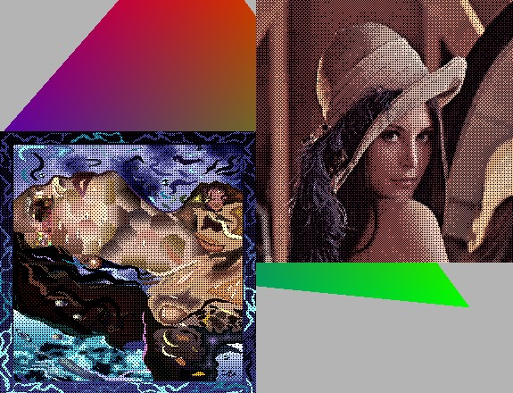

# GraphicsPlayground

A C++ graphics application built with the Grafit graphics library. This project demonstrates basic 2D graphics rendering including textures, sprites, triangles, and shader support.

## Features

- Cross-platform support (Windows, macOS, Linux)
- OpenGL-based rendering using the custom Grafit graphics library
- Sprite and texture rendering
- Triangle geometry rendering
- FPS counter and statistics display
- Virtual file system support with PhysFS integration
- Resource management system
- Signal/slot event system
- Promise-based asynchronous operations
- Shader compilation and loading

## Dependencies

The project uses several external libraries:
- **Boost** - General purpose C++ libraries
- **GLFW** - Window management and OpenGL context creation
- **PhysFS** - Virtual file system for resource management
- **stb_image** - Image loading
- **OpenGL** - Graphics rendering API

## Building

### Prerequisites
- CMake 3.6 or higher
- C++17 compatible compiler
- OpenGL development libraries

### Build Steps

1. Clone the repository:
   ```bash
   git clone <repository-url>
   cd GraphicsPlayground
   ```

2. Initialize and update submodules:
   ```bash
   git submodule update --init
   ```

3. Create a build directory:
   ```bash
   mkdir build
   cd build
   ```

4. Configure with CMake:
   ```bash
   cmake ..
   ```

5. Build the project:
   ```bash
   cmake --build .
   ```

The executable will be created in the `helloworld` subdirectory within your build folder.

## Usage

The application creates a window displaying:
- A bitmap image (Lenna.png)
- A sprite with texture repeat
- A triangle primitive
- Real-time FPS counter in the window title

The window supports vertical sync and displays OpenGL version information at startup.

## Screenshots



## Project Structure

The project consists of two main components:
- **Grafit** - Custom graphics library with modules for system utilities, graphics rendering, and window management
- **HelloWorld** - Main application demonstrating the Grafit library capabilities

## System Information

The application displays system information including:
- OpenGL vendor, renderer, and version
- GLSL version
- Display DPI
- User and host names
- Application, user, and temporary directories

## License

This project appears to be a demonstration/learning project for graphics programming with C++.